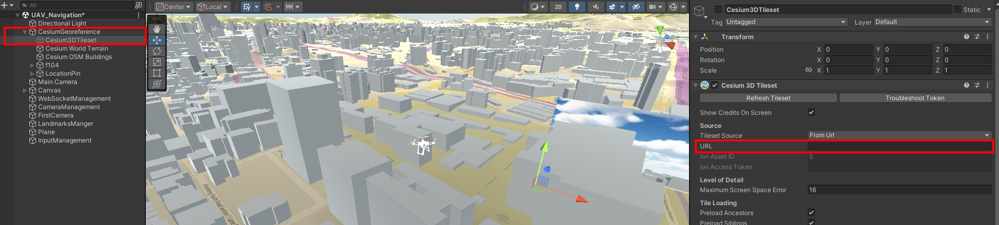
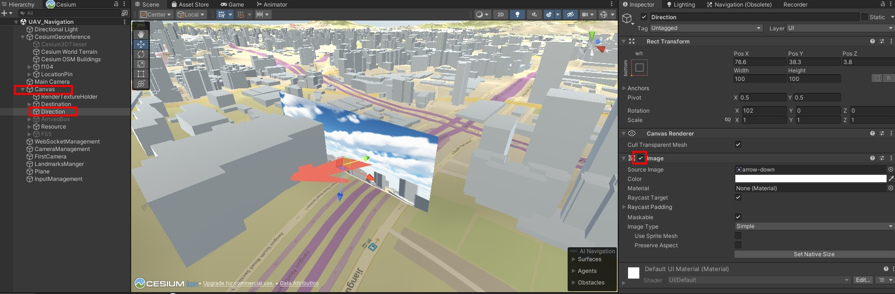

# UAV-Navigation

## 使用套件

- CESIUM（如使用Package匯入Unity，要額外將Cesium的Package也匯入，參考下方連結）
- Google 3D Tiles

## 參考連結
- (https://github.com/CesiumGS/cesium-unity-samples?tab=readme-ov-file)
- (https://cesium.com/learn/unity/unity-photorealistic-3d-tiles/)
- (https://www.youtube.com/watch?v=u6wW5ZIIrpc&ab_channel=DALAB)

## 開啟Google 3D Tiles模式
>將Cesium3DTileset開啟（Inspect視窗打勾），並設定URL如下圖

>將Cesium World Terrain 和 Cesium OSM Buildings關閉（Inspect視窗取消打勾）

## 指引箭頭
>如下圖可將指引箭頭打開

## 操作方法
- V：切換第一人稱與第三人稱視角

### 第三人稱視角操作
- W/S：視角前後移動
- A/D：視角左右移動
- 點擊右鍵：旋轉視角

### 第一人稱視角操作
- 方向鍵（上/下）：無人機前後移動
- 方向鍵（左/右）：無人機左右旋轉
- O/P：無人機向上/下飛行

## 注意事項
>Google 3D Tiles 每個月有免費額限制，參考以下網址！
- (https://mapsplatform.google.com/pricing/)

- 140交接光碟有完整的Unity檔案
